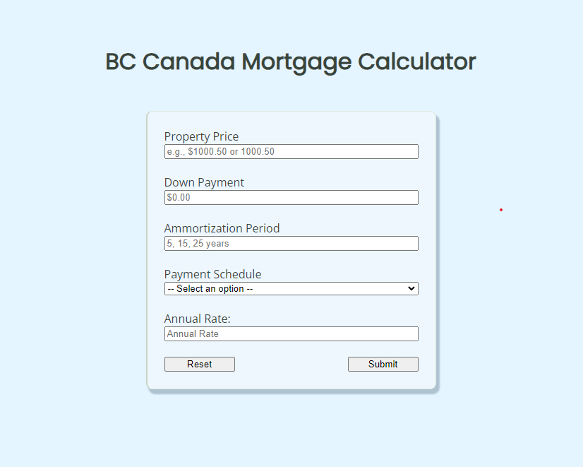
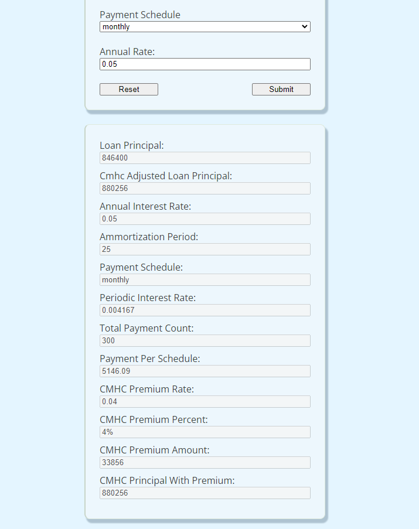
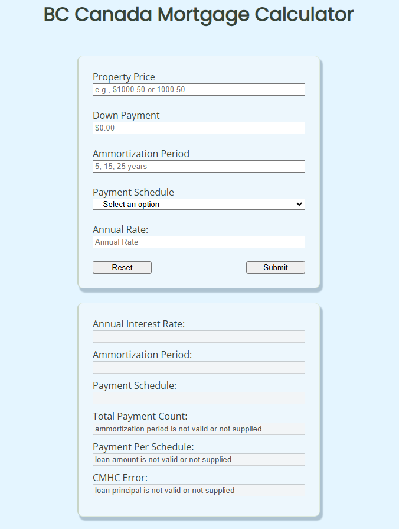

# Canada BC Mortgage Calculator

This project showcases BC Mortgage Calculator implemented in Node.js and Express.js

### Specifications:
- CMHC insurance must be considered. Guidelines for the calculation, and restrictions, can be
found here: https://www.ratehub.ca/cmhc-insurance-british-columbia.
- The API accepts the following json payload via *http POST Method*:
```
{
    propertyPrice: <Number> (property price),
    downPayment: <Number> (down payment amount),
    annualInterestRate: <Number> (annual interest rate),
    ammortizationPeriod: <Integer> (5 year increments between 5 and 30 years),
    paymentSchedule: <String> (accelerated bi-weekly, bi-weekly, monthly)
}
```
### Response:
- Payment per payment schedule
- An error if the inputs are not valid. This includes cases where the down payment is not large enough.


### Requirements:
- Node.js (V20.12.0 LTS)

*Dependencies*
- Express.js

*Dev Dependencies*
- babel
- jest
- webpack
- webpack-cli
- babel-jest
- babel-loader
- jest-webpack
- nodemon


# Table of Contents
- [Setup and Installation](#setup-and-installation)
- [Usage](#usage)
    - [user interface](#user-interface)
    - [core](#core)
    - [api](./api/README.md)
- [Development](#development)
- [Components](#components)
- [Test](#test)
    - [Test Guidelines](./test/README.md) 
    - [unit](./test/README.md#unit-testing) 
    - [integration](./test/README.md#integration-testing) 


# Setup and Installation

QUICK SETUP:

Please make sure the *setup.sh* has enough privilege. Otherwise can be performed with the following command in Linux Terminal
```
sudo chmod +x ./setup.sh
```
and then run
```
npm run setup
```
The script will install the necessary dependencies for the application to run.


STEPS:

The application needs to be setup in a specific order: *`UTILS`, `CORE`, `API`*

Each component has its own setup script that can be called:
```
npm run setup
```
The command will install the necessary dependencies and build a dist version.

After installing the three components, proceed installing the *`ROOT DIRECTORY`* with 
```
npm i
```


## Build
```
npm run build
```
or manually run each component
```
npm run build:api
npm run build:core
npm run build:utils
```


## Running API

to run the development version
```
npm run serve:api
```
to run the build version
```
npm run serve:api-dist
```
# Usage

After getting things up and running, There are 2 endpoints open for this application:
```
/loadClientScript - GET
/calculateMortgage - POST
```
The default route `/` is used to serve the `HTML` and `CSS` page. The webpage, stylesheet, and other assets reside under the `public` folder in the API. The `/loadClientScript` is used to retrieve the javascript used for the frontend. `/calculateMortgage` accepts a *`JSON Payload`* :
```
Sample:

1.

{
  "paymentSchedule": "bi-weekly",
  "propertyPrice": "$920000.00",
  "downPayment": "$73600.00",
  "ammortizationPeriod": "25",
  "annualInterestRate": "0.05"
}


2.

{
    "propertyPrice": "$500,000",
    "downPayment": "$100,000",
    "annualInterestRate": 0.05,
    "paymentSchedule": "accelerated-bi-weekly",
    "ammortizationPeriod": 25
}


3.

{
    "propertyPrice": "$750,000",
    "downPayment": "$120,000",
    "annualInterestRate": 0.05,
    "paymentSchedule": "monthly",
    "ammortizationPeriod": 25
}
```

The endpoint returns back a *`JSON Response`* like the Following:
```
{
    "loanPrincipal": 630000,
    "cmhcAdjustedLoanPrincipal": 647640,
    "annualInterestRate": 0.05,
    "ammortizationPeriod": 25,
    "paymentSchedule": "monthly",
    "periodicInterestRate": 0.004167,
    "totalPaymentCount": 300,
    "paymentPerSchedule": 3786.19,
    "cmhc": {
        "premiumRate": 0.028,
        "premiumPercent": "2.8%",
        "premiumAmount": 17640,
        "principalWithPremium": 647640
    }
}
```
## User Interface


The `UI` is built with `HTML, CSS, and Vanilla Javascript`. The files are located under the `public` directory in the API. While this folder is publicly served the `javascript` files are served via the `/loadClientScript`.



The response will be displayed in a column format including the CHMC rates. The CHMC rates are based on the following [guidelines](./core/README.md#cmhc-general-guidelines).  




Errors are displayed in the column panel.

## Core

The application follows the following formula


More about this can be found here [Core API Documentation](./core/README.md)

## Running Core

to run the development version
```
npm run serve:core
```

## Development

Hot reload is configured to run using Nodemon and can be initialized with the following commands:
```
npm run serve:utils
npm run serve:core
npm run serve:api
```
*Note: please ensure to have the correct privilege for the scripts to execute*
```
sudo chmod +x ./setup.sh
sudo chmod +x ./testAll.sh
```

### Components

API - the front facing component of the app

CORE - contains logic for computing necessary variables needed for mortgage

UTILS - contains supporting functions that help the system like validations and transformations.


Each of the component can be bundled up separately and reused. This is especially useful for components such as the *core* and *utils* where the logic is generic and can be utilized in other applications. The webpack target can also be configured for web and potentially offload *core* or *utils* into the browser to improve resource management.


## Test

The systems comes with both unit and integration tests using JEST. The unit is a comprehensive set of checks ensuring each function in the API, CORE, and UTILS are returning what is expected. The supporting functions/helpers are mocked to focus more on the components being tested.

The integrations test contains sample scenarios of how the functions would interact and ensure that the correct output is derived. The input values are based off of sample json that is located under *samples* folder where the values have been pre-computed. The tests compares the accuracy of the components compared to the pre-computed values.

All the tests are located under the *test* folder and tests for each component can be started with these commands:
```
npm run test:unit
npm run test:integration
```
or to run all the test
```
npm run test
```
Read more about [Test Guidelines](./test/README.md) 
