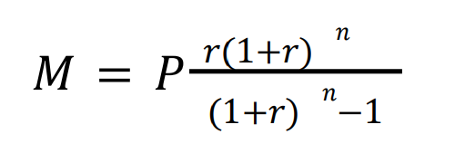

## What Each Term Means:

M (Payment): *The periodic payment (e.g., monthly, bi-weekly) you need to make.*

P (Principal): *The loan amount after subtracting the down payment.*

r (Periodic Interest Rate): *The annual interest rate divided by the number of payments per year.*

n (Total Number of Payments):*The total number of payments over the amortization period.*

## What does it mean in this codebase?

In this codebase, the core components contains the necessary *Calculators* for  that would help derive the mortgage amount needed per chosen ammortization period and downpayment in lieu with property price and annual interest rate.

### P (Principal loan amount)

It Can be derived using *P = Property Price − Down Payment* and is computed in the system using `core.calculateLoanPrincipal`. the function accepts two arguments, `propertyPrice` and `downPayment` and returns an OBJECT with the following properties `loanPrincipal`, `downpaymentRate`, `downpaymentPercentage`.

### r (Periodic Interest Rate)

The periodic interest rate is derived using *r = annual Interest Rate / payments per year*. This is computed using `core.calculatePeriodicInterest` which accpets user supplied `annualInterestRate` and a *PAYMENT SCHEDULE* which can be `monthly`, `bi-weekly`, or `accelerated-bi-weekly`. The function will return an OBJECT with the following properties `periodicInterestRate`, `formattedPeriodicInterest`.

### n (Total Number of Payments)

It can be derived with *n = ammortization period × Payments Per Year* and is computed using `core.calculateTotalNumberOfPayments`. The function accepts `ammortizationPeriod` and `paymentSchedule` and returns only a NUMBER `totalPaymentCount`.

### M (the payment amount for each payment cycle)

The formula is translated into:
```
  x = r*((1+r)**n)
  y = ((1+r)**n)-1
  M = P*(x/y)
```
and can calcualtion can be performed using `core.calculateMortage`.
The function accepts `P`, `r`, `n` and returns a NUMBER which corresponds to the amount required per payment period.

### CMHC General Guidelines

The premium rate is based off of the *down payment percentage* and is determined using the following table

| Down Payment (% of Home Price)     | CMHC Insurance Premium Rate  
|------------------------------------|-----------------------------
| 5% - 9.99%                         | 4.00%             
| 10% - 14.99%                       | 3.10%  
| 15% - 19.99%                       | 2.80%   
| 20% or higher                      | 0%

The function `core.cmhcPremiumCalculator` and accepts `loanPrincipal`, and `downpaymentRate`. The returned OBJECT will contain the following properties `premiumRate`, `premiumPercent`, `premiumAmount`, `principalWithPremium`.